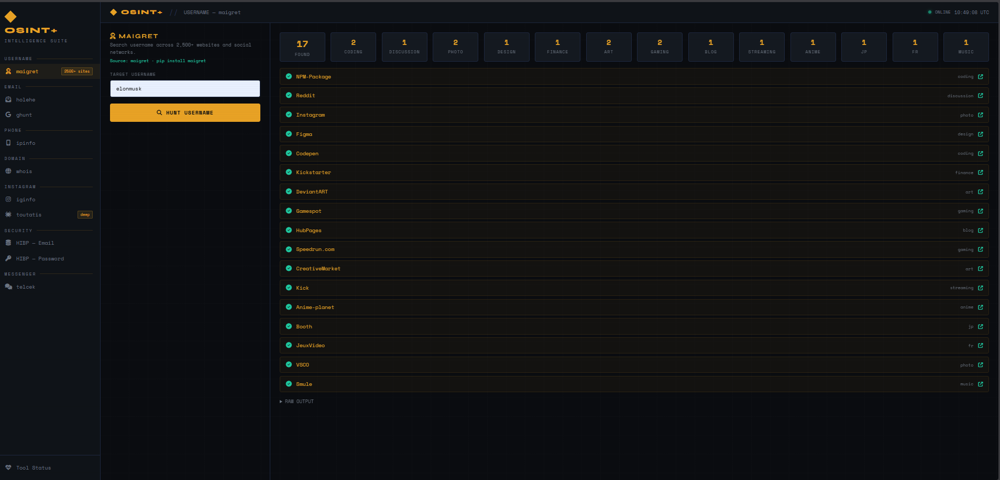

# OSINT Plus

Aplikasi web OSINT (Open Source Intelligence) berbasis Flask yang menggabungkan berbagai tools intelijen sumber terbuka dalam satu antarmuka.



---

## Fitur

| Modul | Tools | Keterangan |
|-------|-------|------------|
| Username OSINT | maigret | Cari username di 3000+ platform |
| Email OSINT | holehe | Cek keberadaan email di 100+ layanan |
| Email OSINT | ghunt | Cek Gmail, Gravatar, profil Google |
| Phone OSINT | phonenumbers + ipinfo | Info nomor HP: negara, carrier, tipe |
| Domain & Infra | whois + DNS + SSL | WHOIS, IP, geolokasi, sertifikat SSL |
| Instagram | Instagram API | Info profil publik/privat |
| Instagram Deep | toutatis | Deep OSINT profil Instagram |
| Security | HIBP Password | Cek apakah password pernah bocor (k-anonymity) |
| Security | HIBP Email | Cek email di database breach (butuh API key) |
| Messenger | telcek | Cek keberadaan nomor di WhatsApp, Telegram, Viber |

---

## Persyaratan

- Python 3.10 atau lebih baru
- pip
- Koneksi internet

---

## Instalasi

### 1. Clone atau download project

```bash
git clone https://github.com/username/osint-plus.git
cd osint-plus
```

### 2. Buat virtual environment

**Windows:**
```bash
python -m venv venv
```

**Linux / macOS:**
```bash
python3 -m venv venv
```

### 3. Aktifkan virtual environment

**Windows:**
```bash
venv\Scripts\activate
```

**Linux / macOS:**
```bash
source venv/bin/activate
```

### 4. Install dependensi

```bash
pip install -r requirements.txt
```

> Proses instalasi membutuhkan waktu beberapa menit karena terdapat dependensi besar seperti maigret dan holehe.

---

## Konfigurasi API Keys

Salin file template konfigurasi:

```bash
cp .env.example .env
```

Buka file `.env` dan isi sesuai kebutuhan:

```env
# Token ipinfo.io untuk Phone OSINT (gratis di ipinfo.io)
IPINFO_TOKEN=your_token_here

# API key Have I Been Pwned untuk cek email breach
# Dapatkan di: haveibeenpwned.com/API/Key
HIBP_API_KEY=your_api_key_here

# Session ID Instagram untuk fitur Instagram OSINT
# Cara mendapatkan:
#   1. Login ke Instagram di browser
#   2. Buka DevTools (F12)
#   3. Buka tab Application → Cookies → instagram.com
#   4. Salin nilai cookie bernama "sessionid"
INSTAGRAM_SESSIONID=your_session_id_here
```

> **Catatan:** Semua API key bersifat opsional. Fitur yang memerlukan key tertentu akan menampilkan pesan jika key belum dikonfigurasi. Fitur HIBP Password, Phone, Domain, Username, dan Email holehe/ghunt dapat berjalan tanpa API key.

---

## Menjalankan Aplikasi

**Windows:**
```bash
venv\Scripts\python.exe app.py
```

**Linux / macOS:**
```bash
python app.py
```

Setelah server berjalan, buka browser dan akses:

```
http://127.0.0.1:7171
```

---

## Cek Status Tools

Buka endpoint berikut di browser atau gunakan curl untuk memastikan semua tools terdeteksi:

```
http://127.0.0.1:7171/api/status
```

Contoh respons:
```json
{
  "tools": {
    "maigret": true,
    "holehe": true,
    "instaloader": true,
    "toutatis": true,
    "phonenumbers": true,
    "whois": true,
    "requests": true,
    "hibp_key": false,
    "ipinfo_token": false,
    "ig_session": false
  }
}
```

---

## Struktur Direktori

```
osint-plus/
├── app.py              # Backend Flask (semua route & logic)
├── requirements.txt    # Dependensi Python
├── .env                # Konfigurasi API keys (jangan di-commit)
├── .env.example        # Template konfigurasi
├── templates/
│   └── index.html      # Antarmuka web (single-page app)
└── README.md
```

---

## API Endpoints

| Method | Endpoint | Deskripsi |
|--------|----------|-----------|
| GET | `/` | Halaman utama |
| GET | `/api/status` | Cek status semua tools |
| POST | `/api/username/maigret` | Pencarian username |
| POST | `/api/email/holehe` | Cek email di layanan |
| POST | `/api/email/ghunt` | Google OSINT email |
| POST | `/api/phone` | Lookup nomor HP |
| POST | `/api/domain` | WHOIS & info domain |
| POST | `/api/instagram/info` | Info profil Instagram |
| POST | `/api/instagram/toutatis` | Deep scan Instagram |
| POST | `/api/hibp/email` | Cek email di breach database |
| POST | `/api/hibp/password` | Cek password bocor (k-anonymity) |
| POST | `/api/messenger` | Cek nomor di messenger apps |

---

## Catatan Penting

- **HIBP Password** menggunakan metode **k-anonymity** — hanya 5 karakter pertama SHA1 yang dikirim ke server. Password asli tidak pernah meninggalkan perangkat Anda.
- **Instagram** memerlukan session ID yang valid. Session ID akan expired jika Anda logout dari Instagram.
- **maigret** mencari username di ribuan platform sehingga membutuhkan waktu hingga 3 menit.
- **holehe** mengecek 100+ layanan email sehingga membutuhkan waktu 30–60 detik.
- Gunakan aplikasi ini hanya untuk keperluan yang sah dan etis.

---

## Lisensi

Proyek ini dibuat untuk tujuan edukasi dan riset keamanan informasi.
